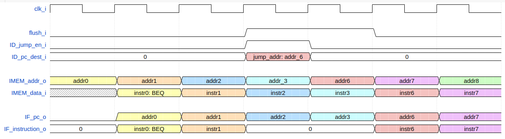
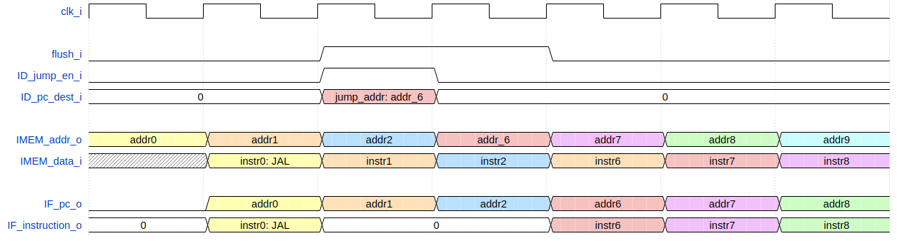

.. _instruction_fetch:

Instruction Fetch Stage (IF)
============================

The Instruction Fetch stage (:file:`rtl/toast_IF_stage`) drives the instruction memory interface and fetches new instructions for the pipeline. The instruction memory is word-addressable and misaligned access is not allowed.

The boot address on initialization or reset can be set via **boot_addr_i**.

Normal Operation:
-----------------

.. figure:: images/IF.png
    :name: if_timing
    :align: center

As seen in the timing diagram, the IF stage places instruction addresses on the **IMEM_addr_o** bus. On the next clock edge, the instruction memory places the corresponding instruction on the **IMEM_data_i** bus. 

The instruction address on **IMEM_addr_o** is flopped to align the fetched instruction with its PC value, and is passed onto the ID stage.

Conditional Branch Taken:
-------------------------

In the event that a conditional branch is taken, the IF stage requires two cycles to fetch the instruction corresponding to the branch destination PC.

In this example, BEQ is taken on the fourth clock cycle, with a branch destination denoted as **jump_addr**. 

After **ID_jump_en_i** is asserted, the IF stage places **jump_addr** on the **IMEM_addr_o** bus on the next rising edge, and the corresponding instruction is fetched on the cycle following that, resulting in a total of four cycles from when the BEQ instruction is fetched.

Jump Taken:
-----------

Unconditional jumps (JAL and JALR) are handled in the same manner and require four cycles to execute.