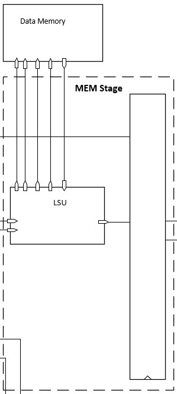
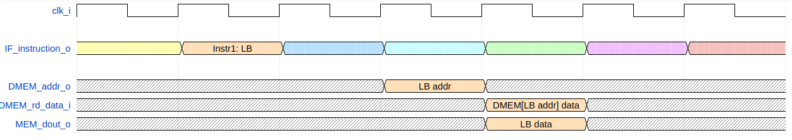
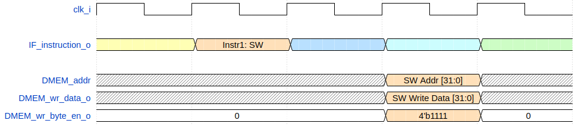

.. _mem:

Memory Stage (MEM)
==================

The Memory Stage (:file:`toast_MEM_stage`) handles all data memory loads and stores and serves as the Load Store Unit. The data memory is byte-addressable, however misaligned loads and stores are not allowed.

Loads:
------

The above timing diagram shows the process of writing data to memory. In the second clock cycle, a **LB** instruction is fetched. The memory address to be accessed is computed in the fourth cycle by the EX stage, and placed on **DMEM_addr_o**. On the next cycle, the memory places the data corresponding to the address on **DMEM_rd_data_i**, and the masked data is placed on **MEM_dout_o** on the same cycle.

Stores:
-------

